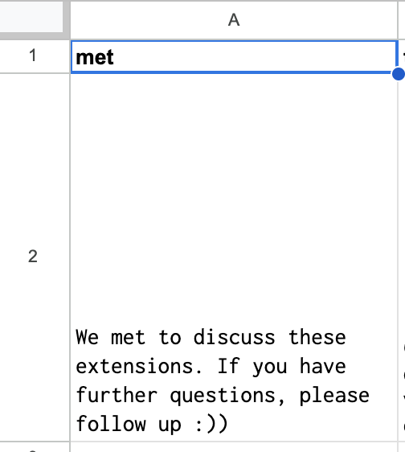
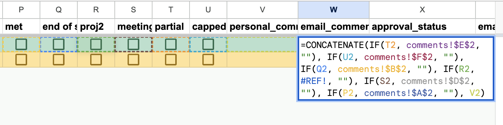

[WARNING]
This document is subject to change while this message is still visible. 

This page will list out quick responses, common bugs and their fixes, as well as workflow suggestions. 

# FAQs
## While getting started
* [I want to ask a different set of questions on the Google form](#form-questions)
* [Do I need to ask if students are enrolled in DSP?](#do-i-need-to-ask-if-students-are-enrolled-in-dsp)
* [I want to modify the email sent to students](#modify-email)
* [Are there any additional guides or other documentation I can look at?](#add-doc)
* [Do I need to add all students to the roster at the beginning of the semester?](#roster)
* [What if I want to change an assignment deadline after extension requests have already come in?](#change-deadline)
## After walking through [GETTING_STARTED.md](https://github.com/cs161-staff/extensions/blob/master/GETTING_STARTED.md)
* [I want to add custom comments without copy-pasting](#custom-comments)
* [The Form Responses tab is filling, but the Roster tab is not](#the-form-responses-tab-is-filling-but-the-roster-tab-is-not)
* [I want to change the name of the slack channel](#i-want-to-change-the-name-of-the-slack-channel)
* [People are not being correctly tagged in the Slack channel](#slack-tag)
## Error messages
* ["Student \<name\> responded '' to DSP question in extension request, but is not marked for DSP approval on the roster. Please investigate!"](#snr)
* ["Error: ('An error occurred while sending an email:', Exception(... Insufficient system storage', 'cs162ta@cs162.eecs.berkeley.edu'))"](#cs162)
* ["\[https://www.gradescope.com/courses/<...> \] \[2\] failed to extend assignment in Gradescope: internal Gradescope error occurred (An error occurred in a request to Gradescope servers. Details: Status Code: 401 Error: could not load assignment <...>"](#gradescopeerr)
* ["SyntaxError: Unexpected token 'u', 'upstream r' ... is not valid JSON" on Google Sheet](#sheet-syntax-error)

### I want to ask a different set of questions on the Google form.
>It is possible to edit the Google form to skip some of the questions on the template form, ask the questions in a different way, or ask additional  questions. We recommend keeping all questions from the template form in your Google form because the following keys on the **Spreadsheet/Form Questions** tab are required for Flextensions to work: `timestamp`, `email`, `is_dsp`, `knows_assignments`, `assignments`, `days`, `reason`, `documentation`, `has_partner`, `partner_email`, and `game_plan`. To skip a question, place that question in a section of the form that students will never reach according to [form logic](https://support.google.com/appsheet/answer/10107390?hl=en#:~:text=Conditional%20branching%20in%20Google%20Forms&text=This%20is%20helpful%20to%20remember,navigation%20paths%20for%20each%20option.). Then, ensure that the question-key mapping on the **Spreadsheet/Form Questions** tab is still valid.

>Changing the wording of a question, rearranging the order of questions, or including additional questions will not impact performance when the keys on the **Spreadsheet/Form Questions** tab are correctly mapped to questions. Once you've finished creating your form, have linked it to the Extensions Backend Spreedsheet and renamed the tab to "Form Responses", paste `=TRANSPOSE('Form Responses'!A1:X1)` into cell A2 of the **Spreadsheet/Form Questions** tab. Adjust the "key" column, ensuring that all required keys (listed above) are present. If you have added questions you may choose a unique key name for each or you may set the key name(s) to `ignore` (as you should do for "Rerun"). Do not re-use the key names of the required keys.

### Do I need to ask if students are enrolled in DSP?
>The scripts require the `is_dsp` key to in the **Spreadsheet/Form Questions** tab to work. The recommended way to retain this key is to keep the DSP status question in the Google form and using [form logic](https://support.google.com/appsheet/answer/10107390?hl=en#:~:text=Conditional%20branching%20in%20Google%20Forms&text=This%20is%20helpful%20to%20remember,navigation%20paths%20for%20each%20option.) to place this question in a section of the form that students will never reach.

### I want to modify the email sent to students.
>You can use the built in method of the email column comments! Check out [an example here.](https://docs.google.com/spreadsheets/d/17-NKHpKrdW-1t1SoxMXHBvfF-Dery6lfefhPUW62WQM/edit?usp=sharing)

>Feel free to [fork](https://docs.github.com/en/get-started/quickstart/fork-a-repo) this repo to create your own email template!

### Are there any additional guides or other documentation I can look at?
>Yes. Please note that these are not complete guides or documentation. Also note that these may contain links to CS 161's extension version.
>[Jordan's Fa23 tips and tricks](https://docs.google.com/document/d/1_BOKVyhKW8_-tmgtV5qpVAi33aKYKpKd1WmnPCzsYOg/edit?usp=sharing)
>[Data 100 Documentation](https://docs.google.com/document/d/1fL-y164X4peC08uva3G9q06VzDQE9fVqAu9m5ipIScI/edit?usp=sharing)

### Do I need to add all students to the roster at the beginning of the semester?

>No, you don't! This tool adds students to the roster on-demand (e.g. when they submit an extension request). The Google Form collects UC Berkeley emails by default, which is a robust method for identifying students and matching them to an internal CalCentral/grading roster at the end of the semester. That said, it may be useful to pre-populate rows for all students with DSP accomodations, so you have a record of who's approved for accomodations when processing extension requests.

### What if I want to change an assignment deadline after extension requests have already come in?
>You can handle this in any way that you'd like! Two common approaches –
> 1. Clear out previously-assigned extension requests, and email all students who had requested an extension to re-submit an extension if they need more days past the extended deadline. To clear out existing requests, just clear the assignment column on the **Roster.**
> 2. Apply all current extension requests to the new deadline. For this, update the deadline in the **Assignments** tab, filter the **Roster** to all students with an extension request for the assignment, and add all rows to the email queue; then, dispatch emails. All students who requested an extension will receive a new email with an extended deadline that's adjusted to the new deadline.

### I want to add custom comments without copy-pasting.
>You can take advantage of google sheets to do this! On a separate tab, type out any comments you want to be able to toggle off and on for any given email. 

>Back in the roster tab, create two new columns. In one of the columns, column 1, insert a checkbox. In the other column, column 2, you can use the formula `IF(\<cell from column 1\>, \<cell of comment\>, "")`. If you want multiple comments you can use concatenate. 

>To include the comment, toggle on the check box. If the checkbox is unchecked, the formula above will include an empty string instead of the comment.

### The Form Responses tab is filling, but the Roster tab is not.
>Likely, you forgot to share the Google sheet with the Google api: `extensions-sandbox@appspot.gserviceaccount.com` (Part 2, step 3 of Getting Started)

>If you've done that but it still isn't working, another possible fix is to fill the student email column with the entire remaining roster on the **Spreadsheet/Roster** tab.

### I want to change the name of the Slack channel.
>No problem! Changing the name of the Slack channel where the webhook points will not affect it. You should be able to do this with no consequences.

### People are not being correctly tagged in the Slack channel.
>Slack User IDs are workspace specific, so make sure you're copying Slack User IDs from the Slack workspace with the channel linked to your Slack webhook.

### "Student \<name\> responded '' to DSP question in extension request, but is not marked for DSP approval on the roster. Please investigate!" 

>1. the dsp question is not visible to students but exists in the form so that the backend doesn't error. the response to this question will default to ‘’. That causes the response “Student <email> responded ‘’ to DSP question in extension request, but is not marked for DSP approval on the roster. Please investigate!”
>    1. You can get rid of this error by deleting the "is_dsp" column from the roster tab. *Don't remove it from Form Questions*
>1. the dsp question is visible to students, but there is no option for "No". the response to this question will default to ''. That causes the response “Student <email> responded ‘’ to DSP question in extension request, but is not marked for DSP approval on the roster. Please investigate!”
>1. the dsp question is visible to students, they select yes, their row does not yet exist in the roster spreadsheet. That causes a response along the lines “Student responded ‘yes’ to DSP question but is not a DSP student”. You can prevent the response, by going into the roster tab in the backend and marking them down as Yes in the DSP? column. You can do this in 2 ways:
>    1. add all dsp students to the roster before the semester starts and mark them as yes in the dsp column
>    1. whenever a student responds themselves as yes to the dsp question, check in AIM, and then update the dsp column to reflect their response
>1. the dsp question is visible to students and their response is “No”. this will not appear in the response from extension bot

### "Error: ('An error occurred while sending an email:', Exception(... Insufficient system storage', 'cs162ta@cs162.eecs.berkeley.edu'))"
>This is an error with the mailing server we use to send emails, hosted by CS 162 at UC Berkeley. Please contact them! You can either ping in #161-extensions in EECS Crossroads or, as of Fa23, contact Wilson Nguyen.

### "[https://www.gradescope.com/courses/<...> \] \[2\] failed to extend assignment in Gradescope: internal Gradescope error occurred (An error occurred in a request to Gradescope servers. Details: Status Code: 401 Error: could not load assignment <...>)"
>This means there is some error within Gradescope itself. It could be caused by your Gradescope environment variables being incorrect or not leading to an account with permissions to edit assignments

>Example: Your SPA has been aliased to create a gradescope account. The password is incorrect on Environment Variables.

>Ex: The environment variables are correct, but your spa gradescope account is a student in the gradescope (possible if someone resets all accounts on the gradescope course)

### "SyntaxError: Unexpected token 'u', 'upstream r' ... is not valid JSON" on Google Sheet
>This error typically arises when there are many emails in the queue. If you just continue to re-run the "Dispatch Emails" script all extension emails/Gradescope extensions will be processed eventually.
