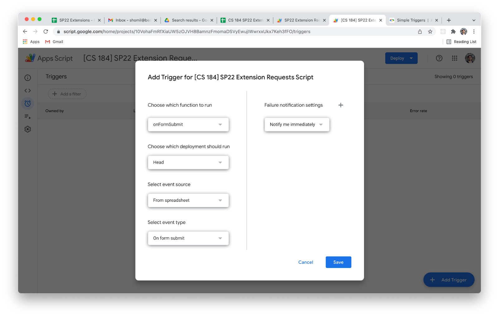

# Getting Started

If you have questions, check out the [FAQ](https://github.com/berkeley-cdss/extensions/blob/master/FAQ.md) or ask in the `#161-extensions` channel on EECS Crossroads.

It takes ~15 minutes to onboard your class onto this tool, and that time pays off as soon as your first extension requests start rolling in :)

### Part 1: Configuring Slack

_Estimated Time: 5 minutes_

You'll need to be a Slack admin in your workspace to follow these steps.

1. Create a Slack channel (ours is named `extension-bot`). Potentially sensitive student information may be accessible in this channel, so we recommend making the channel private and adding those who are approved to manage/view accommodations and DSP information to the channel.
2. [Create a Slack webhook](https://api.slack.com/messaging/webhooks), and point it towards your newly created channel. Feel free to skip past all of the reading and follow these steps:
   - Click "Create your Slack App".
   - Select "From scratch" and enter a name. We named ours "ExtensionBot". Select your workspace.
   - Click "Incoming Webhooks" in the sidebar, scroll down, and create a new web hook.
   - Note the URL. We'll need it later.

### Part 2: Configuring Google Forms/Sheets

_Estimated Time: 10 minutes_

**Cloning the Form and Sheet**

1. Make a copy of [this spreadsheet](https://docs.google.com/spreadsheets/d/17u8VkAefOeiaW8ryMlC8kid8_HOhu3jN-VhXdYtU75s/edit?usp=sharing). Make sure to rename appropriately e.g. "DATA 8 FA24 Extensions Backend"
2. Delete the “Form Responses” sheet within the spreadsheet.
3. Share the spreadsheet with [extensions-sandbox@appspot.gserviceaccount.com](mailto:extensions-sandbox@appspot.gserviceaccount.com). This allows our hosted cloud function to read/write to your sheet. (If you're self-hosting, this should be your service account email.)
4. Make a copy of [this form](https://docs.google.com/forms/d/1uc9NUwxLnfTc1Zlv0Dec1A1Jsu5UYR7-0K2kfTR0Zqs/edit). Make sure to rename it. Close the form template, so you don't accidentally edit it.
5. On the form, in the "Responses" tab, configure the form responses to be written to the Extensions Backend spreadsheet.
   - This should create a new tab within the Extensions Backend sheet.
   - Rename the tab to “Form Responses”.
6. **Set the header of column M of the Form Responses sheet to "Rerun"**. Then, select all of the rows of that column, and insert a checkbox using "Insert" => "Checkbox".

**Configuring Apps Script**

7. On the **Spreadsheet**, open the **Extensions => Apps Script** menu option.

   - Rename the script to "CS \_\_\_\_ SP22 Extension Requests Script".

   - Click on "Triggers" in the sidebar (the little clock icon).

   - Add a **onFormSubmit** trigger that looks like this:
     

**Configuring Roster**

The **Spreadsheet/Roster** tab can hold your entire roster or be configured "on-demand" (when a student submits an extension request). If a student submits several requests, their roster record will be updated in-place; no new roster record will be created.

If you'd like to add student emails (and optionally DSP status), feel free to. The `notes` column on this sheet is for your own use.

**Configuring Assignments**

9. On the **Spreadsheet/Assignments** tab set up a row for each assignment:
   - Enter the assignment name
   - Choose a unique assignment ID
   - Set a due date in YYYY-MM-DD format
   - Set the partner status (either "Yes" or "No")
   - Add a link to the Gradescope assignment if it has been created and you would like to use Flextensions to automatically input extensions to Gradescope. See Step 15 for more information.
     
10. Ensure the following on the **Spreadsheet/Roster** tab:

    - Each assignment has a single column
    - The column headers match the unique assignment ID's in the **Spreadsheet/Assignments** tab

11. On the **Google Form**, update the assignment options to match the assignment names in the **Spreadsheet/Assignments** tab.

**Configuring Form Questions**

12. If you'd like to edit any of the Google form question descriptions, feel free to do so.  Once you've finalized the Google form, check the **Spreadsheet/Form Questions** tab to ensure that the question/key pairings are valid. You will likely need to paste this formula `=TRANSPOSE('Form Responses'!A1:X1)` into cell A2 if you don't see a valid mapping between the questions asked on the Google form and the variable names or see an error message like `#REF!`. If you need to make edits to this tab, you may rearrange the `keys` column, but you should ensure all variables are present.

**Configuring Environment Variables**

13. Finally, configure **Spreadsheet/Environment Variables** as desired.
   - Rows 2 through 6 pertain to emails. The `EMAIL_FROM` field can be any email, but it should be formatted as "Sender Name <some-email@berkeley.edu>".
   - Row 7 is where you should paste your `SLACK_ENDPOINT` .
   - The `SLACK_ENDPOINT_DEBUG` webhook (row 8) is an optional configuration variable: it pipes all debug logs to a CS 161 internal Slack channel. Feel free to delete this row after your system is up and running!
   - Rows 9 through 12 should be adjusted according to your preferences for auto approval.
   - If you want anyone tagged on Slack when extension requests come in, add their Slack ID(s) to row 13.
   - Update row 14 with a link for the spreadsheet you're currently editing.
   - The remaining rows are if you'd like to integrate with Gradescope (see the next part).

### Part 3: Configuring Gradescope (Optional)

*Estimated Time: 5 minutes*

If you'd like your approved extensions to be reflected in Gradescope (using the assignment "extensions" feature), you'll need to configure a staff account.

14. Add an alias of your SPA email address as an instructor to the current semester's Gradescope course.
15. You will likely need to reset your Gradescope password for that account. Note this down.
16. Paste the email/password combination in the `GRADESCOPE_EMAIL` and `GRADESCOPE_PASSWORD` environment variables. Also set cell B15 on **Spreadsheet/Environment Variables** to "Yes". 
17. Add Gradescope assignment URL's to each assignment under the `gradescope` column of the "Assignments" sheet.  The link format should be like: https://www.gradescope.com/courses/COURSE_ID/assignments/ASSIGNMENT_ID/extensions. You can find the unique link for each assignment by clicking the "Extensions" tab on the left sidebar when you're viewing an assignment on Gradescope.
